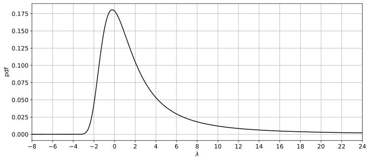
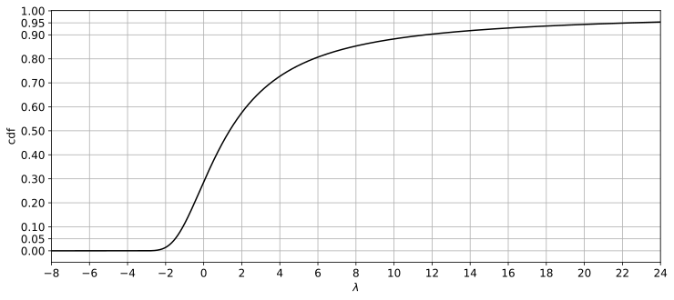
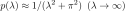

# LandauDistribution 

In probability theory, the Landau distribution is a probability distribution named after Lev Landau.  
Because of the distribution's "fat" tail, the moments of the distribution,  
like mean or variance, are undefined. The distribution is a particular case of stable distribution.  
The stochastic variable is traditionally &lambda;, meaning wavelength. 

## Scipy Contribution
The research content in this repository is published as an implementation in Scipy and Boost.  
[scipy reference](https://github.com/scipy/scipy/blob/9e93f673c4021cc6dc38487dbe8fb2db8cadf131/scipy/stats/_continuous_distns.py#L5777-L5779)

## Definition

The original Landau distribution defined by Landau can be evaluated on real numbers as follows:  

The Landau distribution, generalized to a stable distribution by introducing position and scale parameters, is as follows:  

The relevance of the original definition is as follows:  
  

  
  
  

## Statistics

|stat|&lambda;|note|
|----|----|----|
|mean|N/A|undefined|
|mode|-0.2227829812564085040618242831248...|p(&lambda;)=0.1806556338205509427830338852686...|
|variance|N/A|undefined|
|median|        1.3557804209908013250320928093907...||
|0.01-quantile|-2.1048979093493976933783499309591...||
|0.05-quantile|-1.4982541517778027339600345356285...||
|0.1-quantile |-1.0922545280548463542264694944364...||
|0.25-quantile|-0.20464065154575316904929481233852...||
|0.75-quantile| 4.45839461019464834851167812598963...||
|0.9-quantile | 11.6492846844744055699958678468515...||
|0.95-quantile| 22.4502780788727817828880362014437...||
|0.99-quantile| 104.156361812207433543595837172678...||
|entropy      | 2.82421914529393668921060013095374...||

## Property of Tail

The plus *&lambda;* side is a fat-tail.

  

The minus *&lambda;* side decays rapidly.

  

## Numeric Table
[PDF Precision 64](results/pdf_precision64.csv)  
[CDF Precision 64](results/cdf_precision64.csv)  
[Quantile Precision 64](results/quantile_precision64.csv)  

## Double Precision (IEEE 754) Approx
[FP64](https://github.com/tk-yoshimura/LandauDistributionFP64)

## Columns
[Numeric Integration](NumericIntegration)  
[Asymptotic Expansion](AsymptoticExpansion)  
[Random Generation](RandomGeneration)  
[Wolfram Alpha Reference Values](WolframAlphaReference)  

## Padé Approximation of PDF, CDF and Quantile
[Digits150 source](LandauPadeApprox)  
[Digits150 dll](https://github.com/tk-yoshimura/LandauDistribution/releases)  

## Report
[ResearchGate](https://www.researchgate.net/publication/382141401_Numerical_Evaluation_and_High_Precision_Approximation_Formula_for_Landau_Distribution)  
[TechRxiv](https://www.techrxiv.org/users/661998/articles/1085065-numerical-evaluation-and-high-precision-approximation-formula-for-landau-distribution)  

## Reference
[L.Landau, "On the energy loss of fast particles by ionization" (1944)](https://www.semanticscholar.org/paper/On-the-energy-loss-of-fast-particles-by-ionization-Landau/037099731178b3aeebca36a054852e4c4866a1c3)  
[W.Börsch-Supan, "On the Evaluation of the Function &Phi;(&lambda;) for Real Values of &lambda;" (1961)](https://nvlpubs.nist.gov/nistpubs/jres/65B/jresv65Bn4p245_A1b.pdf)  
[K.S.Kölbig and B.Schorr, "Asymptotic expansions for the Landau density and distribution functions" (1983)](https://www.sciencedirect.com/science/article/abs/pii/0010465584900651)  
[K.S.Kölbig, "On the integral from 0 to infinity of exp(-mu t) t^(nu-1) log(t)^m dt" (1982)](https://inspirehep.net/literature/178407)
